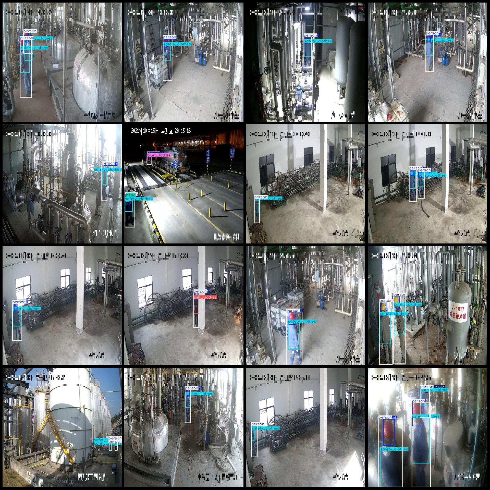
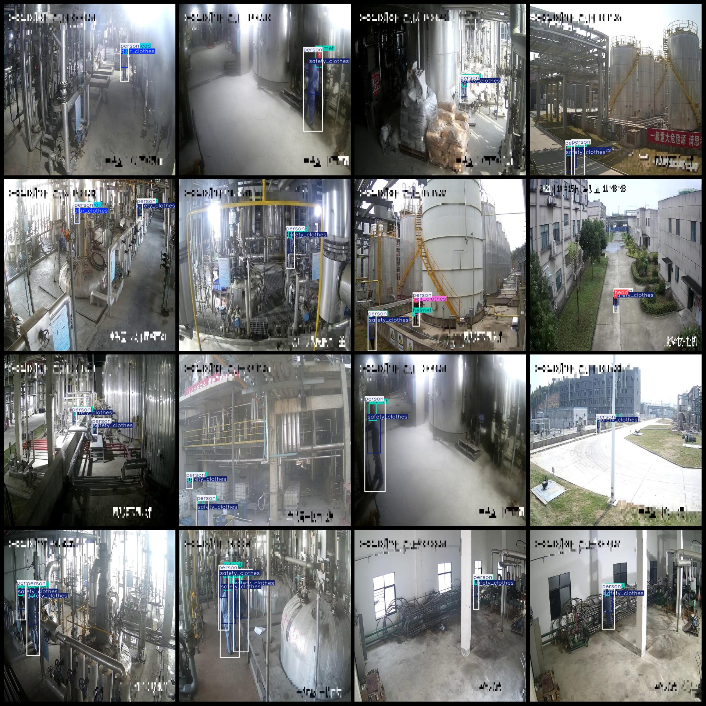

# Industrial Production Safety Equipment and Helmet Inspection Data Set in VOC+YOLO Format with 12,369 Images of 7 Categories

dataset format: Pascal VOC format+YOLO format
(txtfile without split path, only jpgimage and corresponding VOC formatxmlfile and yolo formattxtfile)
number of images: 12369  
annotation count: 12369  
Number of .txt files: 12369
annotationnumber of classes: 7  
Repository: firc-dataset
The labeled category names are: ["blur_clothes", "blur_head", "head", "helmet", "person", "safety_clothes", "self_clothes"]
boxes per class:   
Blur Clothes (1322)
Blur Head (1131)
Head (1199)
Helmet (14295)
Person (17004)
The safety clothes (safety clothing) frame count is 14809.
self_clothes (casual) box count = 779
total boxes: 50539  
image resolution: 640x640  
Using annotation tool: labelImg
Annotation rules: Draw a rectangle around the class.
Special notes: There are no special notes for this dataset.
Special statement: This dataset does not guarantee the accuracy of the trained model or weight file.
Image preview:
Annotation example:
## Images

Here is a pay link on Stripe ( https://buy.stripe.com/3cs8yP7sY87d0vu9AB ). Please contact me lonlonago@foxmail.com after funding $89, and I will send you a complete data files , thank you!

